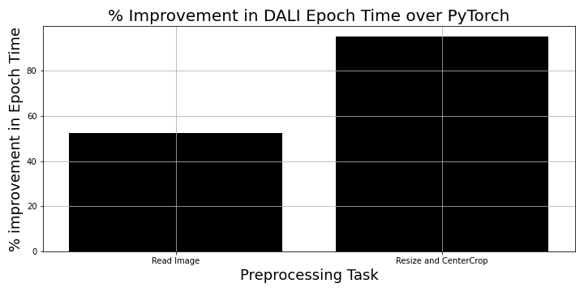

# Accelerate Distributed Training of PyTorch Deep Learning Models with Nvidia DALI dataloaders
In this repo, we will show some results benchmarking data loading and pre-processing speedups obtained with Dataloaders created with [NVIDIA DALI](https://developer.nvidia.com/dali). For distributed training applications, especially those that need to read images and pre-process them, data loading could end up being a bottleneck as traditionally these loading and pre-processing tasks are CPU bound. To this end, we can leverage multi-processing by providing [`num_workers`](https://pytorch.org/docs/stable/data.html) in a PyTorch DataLoader but often that is not enough. With NVIDIA DALI, one can use the existing GPUs to do the data loading and pre-processing of the images that significantly accerelerates data loading, preprocessing and thereby distributed training. Next we will show that for a distributed training example with multi-channel images, average time per epoch can be reduced by upto 95%!

## Data Source
We will use a deep phenotyping multi-channel cell images open sourced [here](https://www.research-collection.ethz.ch/handle/20.500.11850/343106). We will use ~90K images given in the Training set in this data. You can download this data by executing [`./1-get-data.sh`](https://github.com/awsankur/test-dali-dataloaders/blob/main/multi-channel-images/1-get-data.sh). You can run the script [./count_number_of_training_images.sh](https://github.com/awsankur/test-dali-dataloaders/blob/main/multi-channel-images/count_number_of_training_images.sh) to count the number of training images. The images are 5 channel 50x50 tiff 

## Installing DALI
The latest version of DALI is included in the latest PyTorch [NGC container](https://catalog.ngc.nvidia.com/orgs/nvidia/containers/pytorch). In this work we use an image built from `nvcr.io/nvidia/pytorch:23.06-py3`.

## Configuration
Instance: p3.8xlarge
GPU: Tesla V-100
AMI: Deep Learning AMI GPU PyTorch 2.0.1 (Amazon Linux 2) 20230627
PyTorch Version: 2.01
Cuda Version: 12.1
Nvidia Driver Version: 525.85.12
Python Version: 3.10.6

## Steps to Reproduce Result
1. Edit [docker.properties](https://github.com/awsankur/test-dali-dataloaders/blob/main/multi-channel-images/docker/docker.properties) to use a different BASE image or change docker image or container names.
2. [PyTorch Dataloader](https://github.com/awsankur/test-dali-dataloaders/blob/main/multi-channel-images/docker/test-pytorch-dataloader.py) defines the PyTorch Dataset class and the Dataloader definition:
a. The code just includes two transforms Resize and CenterCrop. You can add more [transforms](https://pytorch.org/vision/stable/transforms.html) here.
b. The code iterates over `num_workers` from 0 to `max_num_workers = int(number_of_cpus/number_of_gpus)` because in distributed training each GPU will get so many CPUs to load the data
c. Epoch time is averaged over 3 runs
3. [DALI dataloader](https://github.com/awsankur/test-dali-dataloaders/blob/main/multi-channel-images/docker/test-dali-dataloader.py) deines the DALI pipeline and a generator for a PyTorch like dataloader.
a. The pipeline performance does improve by `num_threads` argument, so a loop is included to study its effect.
b. Since DALI leverages GPUs for loading and pre-processing the data, GPU utilization was measured by `watch nvidia-smi` in a separate terminal.

## Results
Next we show some benchmarking results.

The plot shows almost 50% improvement when just reading the images and almost 95% improvement when resizing and cropping the images. The GPU utilization is 8% when reading images with 7 threads and it increases to 21% when resizing and cropping images. With DALI, the optimum performance was obtained with 7 threads in boh cases. 

  

  

The plot shows average time in seconds per epoch as we increase `num_workers` in the PyTorch Dataloader for two cases i) we just read the images and ii) we resize and center crop the images after reading. As expected, preprocessing the image is about 5 times slower than just reading the image. The plot also shows that after 4 workers, the epoch time does not improve linearly.

  

Finally, the plot below shows the impact of number of threads when setting up a DALI pipeline.

  

